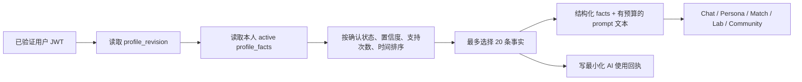

# 个人档案最终数据结构与 AI 使用设计

状态：已实现，待部署
最后更新：2026-07-30
权威迁移：

- `supabase/migrations/20260730160924_finalize_profile_fact_model.sql`
- `supabase/migrations/20260730164814_simplify_profile_fact_visibility.sql`

## 1. 最终结论

个人档案只保留一个内容真相源：`profile_facts`。

- 已删除 `profiles.dims`。
- 已删除 `profile_dimensions`。
- Web、iOS、Edge Functions 不再双读或双写兼容投影。
- 用户直接填写、测评、卡牌结果通过事务 RPC 写入正式事实。
- Chat、日记、实验和推演只能写 `memory_proposals`，用户确认后才能进入正式事实。
- 每条事实只有 `public/private` 两种可见性；本人使用 AI 时可读取自己的两类事实，其他人和公共功能只能使用发布后的公开事实。
- 公开主页草稿与真正公开数据分表，敏感主页字段不会因表名叫 `public_profiles` 而被公开读取。
- 不保留旧客户端兼容层，也不使用 mock 画像填充空档案。
- 真人验证只预留服务端状态字段，未来可由支付宝等可信提供方写入；客户端不能自行标记为已验证。

## 2. 六大项如何映射

首页六大项对应六个固定 `dimension`：

| 产品项 | dimension | 常见来源 |
|---|---|---|
| 人格底色 | `personality` | 大五测评、MBTI、手填 |
| 我擅长 | `skill` | 手填、能力测评、Chat 候选 |
| 我喜欢 | `like` | 手填、兴趣测评、Chat/日记候选 |
| 我在恋爱关系中在意 | `love` | 关系测评、婚姻卡牌、手填 |
| 我在家庭关系中在意 | `family` | 家庭卡牌、手填 |
| 我在人际交往中在意 | `social` | 社交卡牌、手填 |

另有 `life` 表示“人生底牌”，来自人生卡牌等业务。数据库因此允许 7 个维度，但首页六大项的结构没有混入页面文案或自由 key。

一个维度不是一段拼接字符串，而是多条可独立管理的事实。例如：

```json
[
  {
    "dimension": "skill",
    "fact_kind": "capability",
    "value": "能把复杂问题拆成可执行步骤",
    "visibility": "private",
    "source": "manual",
    "confidence": 1,
    "user_confirmed": true
  },
  {
    "dimension": "like",
    "fact_kind": "preference",
    "value": "喜欢安静阅读",
    "visibility": "public",
    "source": "chat",
    "confidence": 1,
    "user_confirmed": true
  }
]
```

## 3. 表结构与业务职责

| 表 | 业务职责 | 关键字段 | 读写边界 |
|---|---|---|---|
| `profiles` | 用户画像的轻量状态头 | `portrait_pct`、`profile_revision`、验证状态 | 本人读；业务状态由 RPC、验证状态由可信服务更新 |
| `profile_facts` | 唯一权威画像内容 | 维度、事实类型、值、`visibility`、来源、置信度、确认状态、敏感度、有效期、支持次数 | 原始行仅本人读；客户端不能直接写 |
| `profile_fact_evidence` | 每条事实的来源证据 | `fact_id`、`source_type`、`source_id`、版本、作用、置信度 | 本人读；RPC/Worker 写 |
| `memory_proposals` | AI 对用户的待确认理解 | 操作、候选值、来源、置信度、敏感度、状态、去重键、过期时间 | 本人读/审核；AI 只提案 |
| `assessment_runs` | 测评原始记录 | 测评类型、题目版本、答案、分数、结果标签 | 本人读；与事实原子写入 |
| `card_game_results` | 卡牌玩法原始记录 | 卡牌类型、最终牌、轮次、接受/交换过程 | 本人读；与事实原子写入 |
| `profile_public_drafts` | 公开主页的完整私有草稿 | 故事、轨迹、服务、建议等 | 仅本人 |
| `public_profiles` | 真正允许匿名读取的发布结果 | 名称、头像、短简介、标签、色相、`published_facts`、`is_verified` | `anon/authenticated` 只读 |
| `persona_jobs` | AI 形象生成结果 | 任务状态、persona、错误信息 | 仅本人 |
| `app_events` | AI 使用最小回执及通用埋点 | event、无原文 props、时间 | 客户端不可读；隐私 API 只返回本人的最小回执 |

### 3.1 `profiles`

`profiles` 不再保存画像正文，承担画像状态与服务端验证状态：

- `portrait_pct`：产品展示完成度。
- `profile_revision`：正式事实的乐观并发版本。
- `verification_status`：`unverified | pending | verified | rejected`。
- `verification_provider`：未来可信验证提供方标识，例如支付宝；不保存其证件原文。
- `verified_at`：验证成功时间。

客户端只有 SELECT 权限，不能直接更新验证字段。验证状态变化会自动同步 `public_profiles.is_verified`，公开面只暴露布尔结果。

### 3.2 `profile_facts`

关键字段：

- `dimension`：`personality | skill | like | love | family | social | life`
- `fact_kind`：`preference | capability | value | goal | constraint | relationship_need | life_stage | self_description | pattern`
- `value / normalized_value`：展示值和规范化去重值
- `visibility`：`private | public`，默认 `private`
- `source`：`manual | assessment | card_game | chat | diary | lab | simulation | legacy`
- `source_ref`：会话、日记、测评或卡牌结果引用
- `confidence`：0–1
- `user_confirmed`：是否经过本人确认
- `status`：`active | superseded`
- `sensitivity`：`low | medium | high`
- `valid_from / valid_to`：事实有效期
- `support_count / last_supported_at`：多次观察强化信息
- `observed_at / created_at / updated_at`

唯一约束是 `(user_id, dimension, value)`。删除一个维度会级联删除该维度的证据和待确认候选。

### 3.3 `profile_fact_evidence`

事实与证据分表，避免把“事实”与“为什么相信它”混为一体。

- `source_type` 支持手填、测评、卡牌、对话、日记、实验和推演。
- `source_id + source_version` 指向具体来源版本。
- `evidence_role` 支持 `supports | contradicts | corrects`。
- 同一事实、来源、来源 ID、证据作用只保留一条。

匿名账号合并时，重复事实的证据会先迁到正式账号保留的事实，再删除重复事实，避免级联丢失证据。

### 3.4 `memory_proposals`

AI 不直接改 `profile_facts`。Chat、日记、实验和推演只能创建候选：

```text
AI 观察
→ memory_proposals.pending
→ 用户接受
→ profile_facts + profile_fact_evidence
→ proposal.status = applied
```

用户拒绝后状态为 `rejected`。候选按“用户 + 去重键”幂等，默认 30 天过期。接受候选会递增 `profile_revision`；拒绝不会改变正式事实版本。

### 3.5 测评与卡牌

测评和卡牌各自保留原始结果，不能只留下几个展示标签：

- `save_assessment_and_profile`：同一事务写 `assessment_runs` 和正式事实。
- `save_card_game_and_profile`：同一事务写 `card_game_results` 和正式事实。

这样 AI 能读取稳定事实，产品和研究又能追溯答案、分数、题目版本或卡牌过程。

### 3.6 可见性与 AI 使用

不再维护“维度 × 用途”的权限矩阵。权限只由事实所有权与事实级 `visibility` 决定：

| 数据使用者 | 可使用的事实 |
|---|---|
| 用户本人使用 Chat、Persona、Match、Lab、Simulation、Community | 本人符合质量规则的 `public` 和 `private` 事实 |
| 其他用户、匿名访问、跨用户推荐和相似经历匹配 | 只能读取 `public_profiles.published_facts` 中已发布的 `public` 事实 |

`purpose` 仍保留在 AI 上下文和最小回执中，用来说明哪项功能使用了数据，但不再作为授权开关。

### 3.7 公开主页

公开主页分成两层：

```text
profile_public_drafts
  完整草稿，仅本人读取
          |
          | save_public_profile
          v
public_profiles
  低风险发布字段，匿名只读
```

`public_profiles` 不含年龄、城市、角色转换、完整故事、轨迹、服务或建议等草稿字段。`published_facts` 只包含状态为 active 且 `visibility = 'public'` 的事实，不再使用按维度展示开关。

正式事实被修改、按维度删除或全部清空后，发布事实会在同一数据库事务中刷新，防止公开快照残留已删除内容。

## 4. 写入业务

| 业务 | 正式事实写入 | 原始记录 | 版本行为 |
|---|---|---|---|
| 用户手填六大项 | `replace_profile_dimension` | 无 | `profile_revision + 1` |
| 测评 | `save_assessment_and_profile` | `assessment_runs` | 原子 `profile_revision + 1` |
| 卡牌 | `save_card_game_and_profile` | `card_game_results` | 原子 `profile_revision + 1` |
| Chat 抽取 | `propose_profile_fact` | `memory_proposals` | 不改正式版本 |
| 日记抽取 | Worker 幂等 upsert 提案 | `memory_proposals` | 不改正式版本 |
| 接受 AI 候选 | `review_profile_proposal` | evidence + fact | `profile_revision + 1` |
| 拒绝 AI 候选 | `review_profile_proposal` | proposal rejected | 正式版本不变 |
| 删除一个维度 | `delete_profile_dimension` | 级联删除关联私密数据 | `profile_revision + 1` |
| 设置事实公开/私人 | `set_profile_fact_visibility` | 更新单条 active 事实并刷新公开快照 | `profile_revision + 1` |
| 清空画像 | `clear_profile` | 清事实、证据、候选、测评、卡牌、persona | `profile_revision + 1` |
| 保存公开主页 | `save_public_profile` | 草稿 + 安全发布行 | 不改事实版本 |

所有客户端画像写入口都经过 RPC；`authenticated` 对事实、证据、候选和测评表没有直接写权限。

## 5. AI 读取业务

共享读取器位于 `supabase/functions/_shared/profile-context.ts` 和 `profile-facts.ts`。



质量规则：

- 所有用途都可以读取本人的公开和私人事实。
- 本人确认的 active 事实可使用；未确认事实置信度必须不低于 0.7。
- 最多选择 20 条，仍受 Prompt 字符预算约束。
- 当前请求中用户主动提供的信息始终高于长期画像。
- 查询画像或版本失败时 fail closed：当前功能继续，但不附带长期画像。

响应中的 `ai_context` 只披露用途、使用的维度/事实 ID、`profile_revision` 和公开/私人事实数量。使用回执不保存事实值、Prompt、聊天内容或日记原文。

## 6. 客户端读取

`GET /get-profile` 返回：

- `portrait_pct`
- `profile_revision`
- `facts`
- `card_games`
- 本人的 `profile_public_drafts`
- 本人的验证状态、提供方标识和验证时间

每条 `facts` 都带 `visibility`。Web 和 iOS 需要展示“维度文本”时，均在客户端把 active `profile_facts` 按 `dimension` 分组；数据库不再保存第二份聚合结果。

隐私中心额外返回：

- active facts
- pending proposals
- `profile_revision`
- 最近最小化 AI 使用回执

导出 schema version 为 2，包含 profile 状态、facts、evidence、proposals、assessment runs、card games、私有主页草稿、安全发布结果、persona jobs 和使用回执，不再包含用途权限矩阵。

## 7. RLS 与安全边界

- `profile_facts`、`profile_fact_evidence`、`memory_proposals`、`assessment_runs`、`profile_public_drafts`：本人 SELECT。
- 上述画像内容表对 `authenticated` 撤销直接写权限，只能经受控 RPC 或 service-role Worker 写入。
- `public_profiles`：`anon/authenticated` 仅 SELECT，不能直接 INSERT/UPDATE/DELETE。
- 所有可由客户端调用的 `security definer` RPC 都显式检查 `auth.uid()`，设置空 `search_path`，并只向 `authenticated` 授权。
- Worker 用 service role 写日记候选；客户端无法伪造 AI 来源。
- 注销账号依靠外键级联删除私密数据；`app_events` 按现有去标识化策略处理。
- `profiles` 的验证状态对本人可读，但客户端没有 UPDATE 权限；未来验证回调只能使用可信服务身份写入。
- 匿名账号合并会迁移事实、证据、候选、测评、公开草稿、日记摘要等新增数据；重复事实合并时 `public` 优先，防止已发布事实意外变私密。

## 8. 不兼容迁移与发布要求

迁移会先把旧 `profiles.dims` 和 `profile_dimensions` 中缺失的内容回填为 `legacy` 事实，然后删除旧表/字段；可见性迁移会保留用户之前明确发布过的维度，其余事实默认为私人。`profile_ai_permissions`、`permission_revision` 和草稿中的维度展示开关会被删除。

数据库迁移、Edge Functions、Web 和 iOS 必须在同一发布窗口切换。本设计明确不提供旧客户端兼容行为。

当前只完成了本地实现和验证，尚未推送远程 Supabase migration，也未部署 Edge Functions。

## 9. 验证

已完成：

- 本地数据库从零执行全部 migration 和 seed。
- Supabase schema lint：0 错误。
- 基础 RLS、日记 v2 RLS、个人档案隐私 RLS 全量通过。
- Edge Functions fmt、lint、typecheck 和单元测试通过。
- 从本地最终数据库重新生成 TypeScript 和 Swift 类型。
- packages/Web TypeScript typecheck 通过。
- Web production build 通过。

待 macOS CI：

- iOS 正式编译。
- iOS 单元测试和关键隐私中心 UI 流程。
