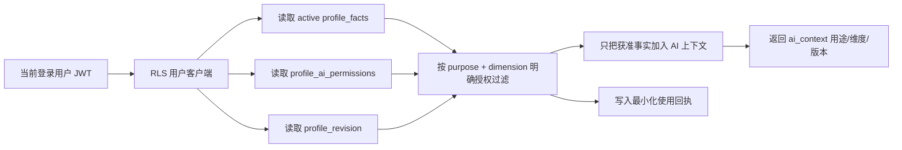

# 个人档案与 AI 使用设计

状态：Phase 1–4 已实现
最后更新：2026-07-30

## 1. 设计目标

个人档案不是一段不断覆盖的长文本，而是由“公开资料、私密事实、授权和使用回执”组成的可追踪数据系统：

- 用户知道系统保存了什么、从哪里得到、是否由本人确认。
- AI 只能读取当前用途明确授权的维度，缺失授权时默认拒绝。
- 本人填写和 AI 推断分开标记，推断不能伪装成确定事实。
- 多设备同时修改时拒绝过期写入，不静默覆盖新版本。
- 用户可以确认、按维度删除、撤回授权、导出或清空私密画像。
- 清空私密画像不会误删公开主页；注销账号仍由独立的账号删除流程负责。

## 2. 数据分层

| 层 | 表/字段 | 内容 | 可见性 |
|---|---|---|---|
| 公开主页 | `public_profiles` | 名称、简介、城市、标签、故事、服务、展示开关 | 按公开主页策略读取；只有本人可写 |
| 私密画像快照 | `profiles` | `dims` 兼容快照、完成度、`profile_revision` | 仅本人 |
| 私密原子事实 | `profile_facts` | 维度、值、来源、置信度、本人确认、状态、时间 | 仅本人 |
| 私密维度聚合 | `profile_dimensions` | 每个维度的 tags 兼容视图 | 仅本人 |
| 原始探索结果 | `card_game_results`、`persona_jobs` | 卡牌选择与数字形象结果 | 仅本人 |
| AI 授权 | `profile_ai_permissions` | `dimension → purpose → boolean` | 仅本人 |
| AI 使用回执 | `app_events.profile_ai_context_used` | 用途、维度键、事实数、画像版本、时间 | 用户经隐私 API 读取最小化回执 |

`profile_facts` 是 AI 长期上下文的权威来源；`profiles.dims` 与 `profile_dimensions` 保留用于旧客户端和主页展示兼容。

## 3. 原子事实结构

每条事实包含：

- `dimension`：`personality | skill | like | love | family | social | life`
- `value`：单条可独立确认或删除的事实
- `source`：`manual | assessment | card_game | chat | diary | legacy`
- `source_ref`：可选的来源引用，例如会话 ID
- `confidence`：0–1
- `user_confirmed`：是否由用户确认
- `status`：`active | superseded`
- `observed_at / created_at / updated_at`

本人填写、测评和卡牌选择默认是已确认事实；聊天与日记抽取默认是待确认推断。AI 提示词会明确携带“用户已确认”或“待用户确认 + 来源 + 置信度”，避免把推断说成事实。

## 4. 写入与版本控制

所有主要画像写路径统一调用 `replace_profile_dimension`：

1. 清洗、去重并限制每个维度最多 20 条事实。
2. 将不再出现的旧事实标为 `superseded`。
3. upsert 当前原子事实并保留来源、置信度和确认状态。
4. 同步更新 `profile_dimensions` 和 `profiles.dims`。
5. 原子递增 `profiles.profile_revision`。

客户端执行确认、按维度删除或清空时提交当前 `profile_revision`。若服务端版本已经变化，RPC 返回 SQLSTATE `40001`，Edge Function 转为 HTTP 409 `PROFILE_REVISION_CONFLICT`，客户端提示刷新后重试。

旧客户端仍可调用 `apply_profile_update`；该 RPC 也会递增版本，但新的画像事实写入应使用 `replace_profile_dimension`。

## 5. AI 读取流程

用途固定为：

- `persona`：动态 AI 形象
- `chat`：探索对话
- `match`：相似经历匹配
- `lab`：人生实验室

任一事实、权限或版本查询失败时 fail closed：不附加长期画像，但不阻断用户当前主动发起的请求。使用回执不记录事实值、prompt、日记或对话原文。

## 6. 隐私中心

Web 与 iOS 的“我的主页 → 账号 → 个人档案与 AI 隐私”均提供：

- 查看当前画像版本和全部 active 事实。
- 查看每条事实的来源、置信度和本人确认状态。
- 确认一条 AI 推断。
- 永久删除一个画像维度及关联卡牌结果。
- 查看最近 AI 使用回执。
- 导出完整 JSON 档案。
- 撤回全部 AI 授权，画像仍保留。
- 清空全部私密画像，公开主页保留。

导出格式：

- `schema`: `possibility.profile-export`
- `schema_version`: `1`
- `exported_at`
- `data`: profile、facts、dimensions、card games、AI permissions、public profile、persona jobs、AI access receipts

## 7. 安全边界

- `profile_facts` 开启 RLS，并分别定义本人 SELECT/INSERT/UPDATE/DELETE 策略。
- `anon` 没有事实表权限，也不能执行画像写 RPC。
- Edge Function 使用用户 JWT 创建数据库上下文，不用 service role 绕过事实表 RLS。
- 只有读取最小化 `app_events` 回执时使用 service role，查询条件来自已验签的 `user.id`，且不返回原始内容。
- AI 权限默认拒绝：不存在权限行、维度键或用途键时均视为 `false`。
- 合并匿名账号时同步迁移事实、版本和授权，并处理同一事实冲突。
- 删除账号仍走 `delete-account`；清空私密画像是范围更小、可理解的独立操作。

## 8. 已完成阶段

### Phase 1：数据分层与用途授权

- 公开主页字段结构化。
- 私密 AI 权限从公开 visibility 中分离。
- persona/chat/match/lab 按用途默认拒绝。
- Web 与 iOS 权限设置界面。

### Phase 2：事实化与来源证据

- `profile_facts` 原子事实表。
- 来源、置信度、确认状态和 superseded 历史。
- 手填、测评、卡牌、聊天、日记写路径统一同步。
- AI 上下文以事实表为权威来源。

### Phase 3：修订、冲突与可解释记录

- 单调递增的 `profile_revision`。
- 乐观并发冲突检测。
- 用户确认推断、按维度删除。
- AI 使用最小化回执与响应版本披露。

### Phase 4：数据权利与端到端管理

- Web/iOS 隐私中心。
- JSON 导出。
- 全部撤权。
- 清空私密画像但保留公开主页。
- RLS、匿名拒绝、跨用户隔离、冲突、删除和保留边界测试。

## 9. 验证清单

- Edge Functions 格式、lint、typecheck 与单元测试。
- 本地数据库从零执行全部 migration 和 seed。
- 基础 RLS、日记 v2 RLS、个人档案隐私 RLS 测试。
- Supabase 生成 TypeScript 与 Swift 数据库类型。
- packages 和 Web TypeScript typecheck。
- Web production build。
- iOS 需在 macOS/Xcode CI 继续执行正式编译与 UI 测试；Linux 开发环境不包含 Swift/Xcode 工具链。
