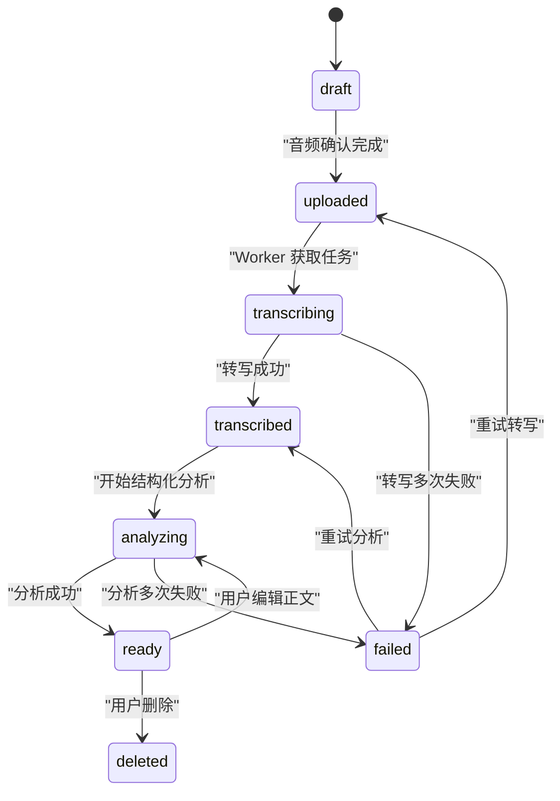
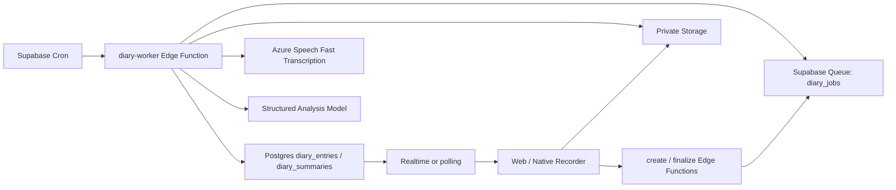
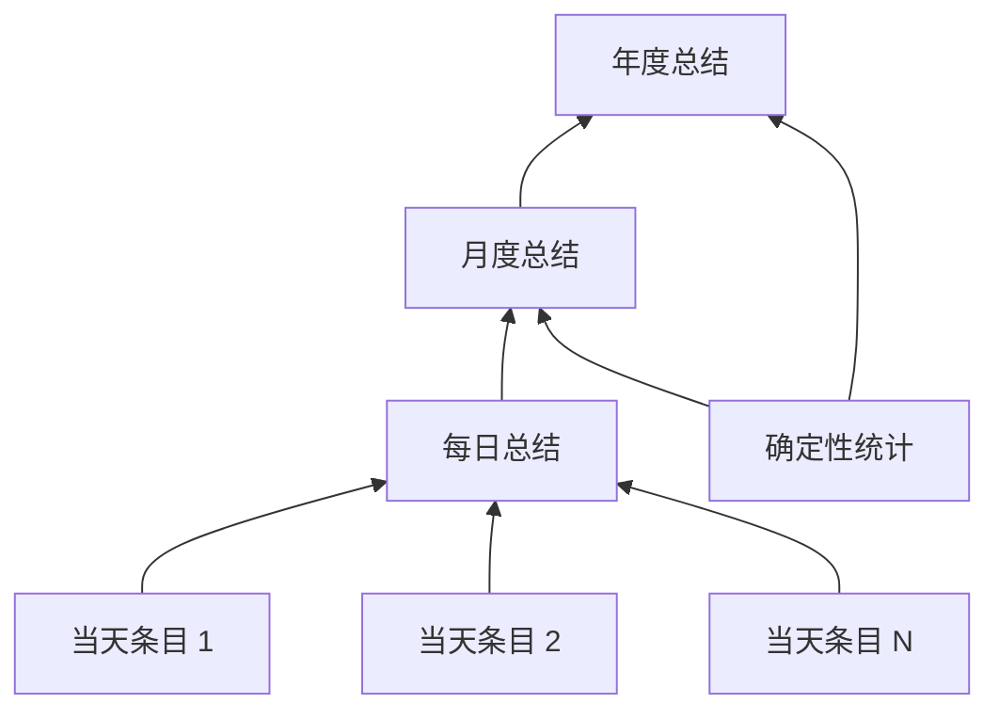

# 语音日记真实数据、转写与 AI 总结系统设计

> 状态：设计稿
> 日期：2026-07-30
> 范围：Next.js Web、Supabase Auth/Postgres/Storage/Edge Functions、语音转写、条目分析、每日/月度/年度总结
> 不在本阶段范围：实际数据库迁移、前后端实现、线上模型密钥配置

## 1. 结论

语音日记不应被实现为一次同步的“录音 → 转文字 → AI 分析 → 插入数据库”请求，而应拆成一条可恢复、可重试、可观察的异步流水线：

1. 用户创建一条日记草稿。
2. 客户端录音并将原始音频上传到私有 Supabase Storage。
3. 服务端确认上传完成，将转写任务写入持久化队列。
4. Worker 调用真实语音转写 API，保存机器原始转写。
5. Worker 对同一条日记做结构化分析，不再新建重复记录。
6. 分析完成后刷新当天 AI 总结，并将对应月份、年份标记为过期。
7. 月度总结读取每日总结及全月统计；年度总结读取月度总结及全年统计。

产品信息结构改为两层：

- “一天”是浏览和总结单位。
- “一条日记”是录音、转写、编辑、播放和删除单位。

同一天可以有任意多条日记。每日页面首先展示当日 AI 总结，下面按时间展示当天的所有原始条目；AI 总结永远不能替代用户原文和原音频。

## 2. 当前实现审计

### 2.1 已有能力

当前仓库已经具备一部分基础设施：

- `diary_entries` 表，包含 `audio_path`、`transcript`、`emotions`、`keywords`。
- 私有 `diary-audio` Storage bucket，以及基于用户目录的读、写、删除策略。
- `analyze-diary`：对文字进行情绪、关键词和画像维度分析。
- `list-diary`：分页读取当前用户的日记。
- `diary-summary`：生成月度或年度总结，并写入 `diary_summary_cache`。
- Auth、匿名用户合并、Edge Function 鉴权、LLM 结构化输出和隐私日志过滤。

因此不需要推翻整个后端，应该做“模型升级 + 处理链拆分 + 前端真实化”。

### 2.2 必须修复的问题

| 问题 | 当前表现 | 后果 |
| --- | --- | --- |
| 首页不是真录音 | 麦克风只是装饰，实际提交 textarea，留空时使用示例文案 | 用户看到的是伪语音体验 |
| Mock 与真实数据混合 | 详情页先放整月 demo，再只追加今天的真实条目 | 用户无法分辨哪些是自己的数据 |
| 日期被当作条目 ID | `selectedDate` 配合 `find()` 只取第一条 | 同一天多条记录会被覆盖 |
| 重分析会插入新行 | `analyze-diary` 分析后直接 `insert diary_entries` | 编辑转写后会产生重复日记 |
| 音频没有进入业务链 | `audio_path` 存在，但创建、上传、转写、播放均未实现 | 无法保留或播放真实录音 |
| 缺少处理状态 | 没有上传中、转写中、分析中、失败等持久状态 | 刷新页面后无法恢复任务 |
| 列表信息不足 | `list-diary` 不返回音频、时长、标题和处理状态 | 前端只能用占位数据 |
| 只看条数判断缓存 | 月/年缓存只比较 `entry_count` | 编辑、删除、重新转写不会刷新总结 |
| 时间边界错误 | 汇总按 UTC 月份/年份查询 | 用户跨时区或晚间录音可能被算到错误日期 |
| 年度总结有年末偏差 | 只取最近 60 条、最多 12,000 字 | 记录越多，年初内容越容易消失 |
| 打开页面触发总结 | 冷启动并发请求月、年总结 | 不必要的等待、并发和模型成本 |
| 匿名音频合并存在风险 | Storage 路径首层是匿名用户 ID | 账号合并后旧路径不再满足新用户 RLS |

## 3. 核心产品决策

### 3.1 真实数据与 Demo 数据彻底分离

生产环境不再回退到 `DIARY_ENTRIES`、`MONTH_SUMMARY` 或 `YEAR_SUMMARY`。

- 加载中：显示 skeleton。
- 无数据：显示真实空状态。
- API 失败：显示错误和重试。
- 没有足够数据生成总结：明确显示“尚未形成总结”。
- Demo 只允许通过单独的开发开关或 Storybook fixture 使用，不能与真实账号数据合并。

### 3.2 首版使用“文件转写”，不使用实时转写

首版使用 Azure AI Speech Fast Transcription：

- 用户完成录音后上传完整文件。
- 服务端异步得到最终转写。
- 不在录音过程中把麦克风流直接发给第三方。

理由：

- 日记是一个有明确结束点的录音，不需要对话级毫秒延迟。
- 先保存音频可以保证转写失败后可重试。
- 文件转写比 Realtime session 更容易处理断网、刷新和后台恢复。
- Azure Fast Transcription 接受常见的浏览器录音容器，支持单文件最长 5 小时、最大 500 MB；产品侧仍使用更严格的 20 MB / 10 分钟限制。

Realtime 转写可以作为二期的“边说边出字幕”，但最终权威转写仍应由保存后的完整文件生成，避免临时片段丢失或前后文不一致。

### 3.3 总结模型与转写模型解耦

- 语音转写：Azure AI Speech Fast Transcription。
- 条目结构化分析：继续复用现有 `structuredOutput` 和 `DEEPSEEK_DIARY_MODEL`。
- 每日总结：低延迟、低成本结构化模型。
- 月度/年度总结：质量优先模型。

所有结果都记录 `provider`、`model`、`prompt_version`、`schema_version`。未来替换模型时不需要迁移业务表。

### 3.4 保存原文，用户编辑不覆盖机器转写

每条日记保留两份文字：

- `transcript_raw`：语音 API 的原始结果，只写一次。
- `transcript_edited`：用户修订后的版本，可为空。

业务使用的最终正文为：

```text
coalesce(transcript_edited, transcript_raw)
```

用户编辑后：

1. 原始转写不丢失。
2. `content_version` 增加。
3. 重新分析同一条日记。
4. 当日、当月、当年总结全部失效并异步重建。

### 3.5 第一次云端保存语音前要求绑定账号

推荐策略：

- 用户可以在未登录状态下开始录音。
- 保存到云端前弹出 AuthGate，完成手机号绑定后再上传。
- 登录过程中音频 Blob 暂存在 IndexedDB，成功后继续上传。

原因是当前匿名账号合并只迁移数据库 `user_id`，不会自动重命名 Storage 对象路径。语音属于高隐私且不可轻易重建的数据，不能让它依赖一个可能丢失的匿名会话。

如果产品坚持匿名云端日记，则必须额外实现“账号合并音频搬迁任务”：服务端复制旧用户目录下的对象、更新 `audio_path`、校验新路径后删除旧对象。首版不推荐承担这套复杂度。

## 4. 用户体验设计

### 4.1 首页语音日记卡

首页只承担“快速记录”和“最近状态”，不承担完整归档。

#### 默认态

- 标题：我的语音日记。
- 真实最近 7 天日历，不再使用固定 emoji。
- 每天显示：
  - 0 条：空心圆点。
  - 1 条：当天主情绪。
  - 多条：主情绪 + 条数徽标。
- 主按钮：“记录一条”。
- 已有今日日记时按钮仍然是“再记一条”，不再把一天限制成一篇。

#### 录音态

- 大号录音计时器。
- 真实输入电平波形。
- 暂停、继续、完成、取消。
- 明确显示最大时长。
- 页面离开前提醒尚未保存。
- 麦克风权限被拒绝时提供系统设置提示和“改为文字记录”。

#### 完成后的处理态

录音完成后立即在界面出现一张本地条目卡：

```text
正在上传 42%
→ 等待转写
→ 正在转写
→ 正在整理
→ 已完成
```

用户无需停留在首页。刷新或重新进入后，状态从数据库恢复。

#### 失败态

失败必须区分：

- `UPLOAD_FAILED`：音频仍在本地，可继续上传。
- `TRANSCRIPTION_FAILED`：云端音频已保存，可重试转写。
- `ANALYSIS_FAILED`：文字已保存，只重试分析。
- `UNSUPPORTED_AUDIO`：提示重新录制或转换格式。
- `QUOTA_EXCEEDED`：提示当日额度或账号限制。

“重试”只重试失败阶段，不得重新创建日记。

### 4.2 每日页面

页面层级：

1. 日期轨。
2. 当日概览。
3. 每日 AI 总结。
4. 当天条目时间线。
5. “再记一条”固定入口。

#### 当日概览

展示确定性数据，不调用 AI：

- 今天记录 N 条。
- 总录音时长。
- 第一条和最后一条记录时间。
- 已完成/处理中/失败数量。

#### 每日 AI 总结

每日总结建议包含：

- `headline`：一句话标题。
- `overview`：80～160 字的当日概览。
- `emotions`：出现过的情绪及相对强度。
- `themes`：3～6 个主题。
- `moments`：具体片段，每个片段必须带来源 `entry_id`。
- `unfinished_threads`：用户明确提到但尚未解决的事情；证据不足返回空数组。

每日总结卡显示：

- “基于今天 N 条日记”。
- “更新于 HH:mm”。
- “有新记录，正在更新”。
- 可展开查看总结引用了哪几条原文。

#### 当天条目时间线

每条卡片独立展示：

- 录制时间、时长和处理状态。
- 播放/暂停和真实音频进度。
- AI 标题、简短摘要、情绪、关键词。
- 转写全文。
- 编辑转写。
- 重试、删除。

同一天多条记录使用 `entry_id` 作为 React key 和选择状态，禁止再用日期作为唯一键。

### 4.3 月度页面

月度页面不是一大段 AI 文案，而是“确定性统计 + AI 解释”：

#### 确定性统计

- 记录天数。
- 条目数。
- 总录音时长。
- 最常记录的时段。
- 情绪标签频次。
- 主题频次。

#### AI 内容

- 本月一句话。
- 150～300 字月度回顾。
- 情绪变化。
- 反复出现的主题。
- 3～5 个高光或转折，每个必须引用日期和条目。
- 从月初到月末发生的变化；没有证据时不生成。
- 一个供用户自行思考的问题，不给强制建议。

本月尚未结束时，标题应显示“7 月进行中”，并标注数据截止时间；月末生成的版本才标记为“7 月回顾”。

### 4.4 年度页面

年度总结不能直接拼接全年原文。推荐输入：

- 12 个月度总结。
- 全年确定性统计。
- 每月代表性片段。
- 被多个月份反复引用的主题。

年度内容：

- 年度一句话。
- 年度情绪和关注主题。
- 实际存在的阶段/章节，不强行生成固定“四个章节”。
- 持续出现的主题。
- 有原文证据的变化。
- 年度高光。
- 写给此刻自己的回望。

当数据不足时减少模块，而不是用文艺文案填满页面。

建议生成门槛：

| 总结 | 最低门槛 | 不满足时 |
| --- | --- | --- |
| 每日 | 至少 1 条 `ready` 日记 | 展示处理中或失败状态 |
| 月度完整总结 | 至少 3 个记录日或 5 条日记 | 只展示统计和简短回顾 |
| 年度完整总结 | 至少 3 个月有数据或 30 条日记 | 展示“年度进行中”的轻量版本 |

这些门槛应为服务端配置，不写死在组件里。

## 5. 数据模型

项目当前是命令式 migration 工作流，落地时应先运行：

```bash
supabase migration new diary_v2
```

再编辑 CLI 创建的 migration 文件，不手写时间戳文件名。

### 5.1 `diary_entries`

为了兼容现有 `bigserial id`，建议添加 `entry_uuid` 作为对外稳定 ID，不直接改主键：

| 字段 | 类型 | 说明 |
| --- | --- | --- |
| `id` | bigint | 现有内部主键 |
| `entry_uuid` | uuid unique not null | 对外 ID、Storage 路径 ID、幂等 ID |
| `user_id` | uuid not null | 所有者 |
| `source` | text | `voice` / `text` |
| `status` | text | 见状态机 |
| `recorded_at` | timestamptz | 实际录制时间 |
| `local_date` | date | 按录制时用户时区固化的日期 |
| `timezone` | text | IANA timezone，如 `America/Toronto` |
| `audio_path` | text | 私有 bucket 对象路径 |
| `audio_mime` | text | 服务端验证后的 MIME |
| `audio_bytes` | bigint | 文件大小 |
| `duration_ms` | integer | 客户端测量，仅用于展示和配额辅助 |
| `transcript_raw` | text | 机器原始转写 |
| `transcript_edited` | text | 用户修订版 |
| `transcript_language` | text | 检测语言 |
| `title` | text | AI 标题 |
| `entry_summary` | text | AI 条目摘要 |
| `emotions` | text[] | 受控情绪标签 |
| `keywords` | text[] | 主题标签 |
| `analysis` | jsonb | 结构化分析扩展字段 |
| `content_version` | integer | 内容每次改变时递增 |
| `transcription_provider` | text | `azure` |
| `transcription_model` | text | 如 `fast-transcription-2025-10-15` |
| `analysis_provider` | text | 如 `deepseek` |
| `analysis_model` | text | 实际模型 |
| `prompt_version` | text | 条目分析 prompt 版本 |
| `attempt_count` | integer | 当前阶段尝试次数 |
| `error_code` | text | 安全错误码，不存上游原始消息 |
| `uploaded_at` | timestamptz | 上传完成 |
| `transcribed_at` | timestamptz | 转写完成 |
| `analyzed_at` | timestamptz | 分析完成 |
| `updated_at` | timestamptz | 最近修改 |
| `deleted_at` | timestamptz | 软删除标记 |

状态机：



数据库约束至少包括：

- `entry_uuid` 唯一。
- `local_date` 非空。
- `duration_ms >= 0`。
- `audio_bytes >= 0`。
- `source = voice` 时，进入 `uploaded` 后必须有 `audio_path`。
- `status = ready` 时必须有最终 transcript。
- `analysis` 顶层必须是 object。

### 5.2 `diary_summaries`

用一张表统一每日、月度和年度总结，替代只存月/年的 `diary_summary_cache`：

| 字段 | 类型 | 说明 |
| --- | --- | --- |
| `id` | uuid | 主键 |
| `user_id` | uuid | 所有者 |
| `period_type` | text | `day` / `month` / `year` |
| `period_start` | date | 日、月初或年初 |
| `status` | text | `pending` / `generating` / `ready` / `failed` |
| `source_fingerprint` | text | 输入版本指纹 |
| `entry_count` | integer | 纳入条目数 |
| `active_day_count` | integer | 有记录的天数 |
| `total_duration_ms` | bigint | 总时长 |
| `summary` | jsonb | 类型化总结内容 |
| `provider` | text | 模型提供方 |
| `model` | text | 实际模型 |
| `prompt_version` | text | Prompt 版本 |
| `schema_version` | integer | JSON schema 版本 |
| `data_cutoff_at` | timestamptz | 数据截止时间 |
| `generated_at` | timestamptz | 生成时间 |
| `error_code` | text | 安全错误码 |
| `attempt_count` | integer | 尝试次数 |
| `created_at` | timestamptz | 创建时间 |
| `updated_at` | timestamptz | 更新时间 |

唯一约束：

```text
(user_id, period_type, period_start)
```

`source_fingerprint` 不再只用条数，而是由所有输入的稳定版本生成。例如每日：

```text
sha256(entry_uuid:content_version:status | ...)
```

月度指纹由每日总结的 `source_fingerprint` 组成；年度指纹由月度总结指纹组成。编辑、删除或重新分析都会自然导致失效。

### 5.3 可选的 `diary_usage_daily`

用于成本与滥用控制，不存内容：

- `user_id`
- `date`
- `audio_bytes`
- `audio_duration_ms`
- `transcription_requests`
- `summary_requests`

所有增量在服务端完成。客户端传入的时长只能作为参考，不能作为唯一计费依据。

## 6. Storage 设计

### 6.1 Bucket

继续使用私有 `diary-audio`：

- public：false。
- per-bucket 最大文件：20 MB；虽然 Azure 上游限制更宽松，但应用侧以移动网络上传、Edge Function 内存和日记实际时长为准。
- 允许类型：
  - `audio/webm`
  - `audio/mp4`
  - `audio/mpeg`
  - `audio/wav`
  - 经测试确认后再补充浏览器实际返回的兼容 MIME。

路径由服务端生成，不能使用用户原始文件名：

```text
<user_id>/<yyyy>/<mm>/<entry_uuid>/source.<ext>
```

音频对象不可覆盖，始终使用唯一 `entry_uuid` 和 `upsert: false`，避免并发录音互相覆盖。

### 6.2 上传方式

- 小于等于 6 MB：Supabase 标准上传。
- 大于 6 MB 或网络不稳定：TUS resumable upload。
- 客户端在 IndexedDB 保存待上传 Blob 和 `entry_uuid`，云端确认后立即清除本地副本。

Supabase 当前文档建议超过 6 MB 使用 TUS resumable upload，以获得重试和断点续传。

### 6.3 RLS

`storage.objects` 保持首层目录等于 `auth.uid()`：

- SELECT：仅本人。
- INSERT：仅本人目录，限制 bucket。
- DELETE：仅本人。
- 不授予 UPDATE，不使用 upsert。

播放时动态生成短期 signed URL，建议 5 分钟有效；数据库只存 `audio_path`，绝不存 signed URL。

### 6.4 删除

删除日记由 Edge Function 完成：

1. 验证 entry owner。
2. 标记 `deleted_at`，立刻从用户查询中消失。
3. 向队列写入 `delete_audio`。
4. Worker 删除 Storage 对象。
5. 成功后硬删除或保留最小墓碑记录。
6. 将日、月、年总结标记为过期。

不能依赖 Postgres 外键级联删除 Storage 文件，因为 Storage 对象不在业务表外键关系中。

用户可选“转写完成后自动删除原音频”：

- 开启后，转写和分析成功即删除音频，仅保留文字。
- 默认是否开启由隐私策略决定。
- UI 必须说明删除原音频后无法再次校对转写。

## 7. API 设计

所有 Function 都先用当前 `requireUser()` 校验 JWT，再使用用户客户端读取本人数据。需要 service role 的队列、缓存写入或 Storage 运维必须在鉴权完成后创建独立服务端 client，secret 永不下发前端。

### 7.1 `create-diary-entry`

请求：

```json
{
  "source": "voice",
  "recorded_at": "2026-07-30T15:22:12.000Z",
  "timezone": "America/Toronto",
  "mime_type": "audio/webm"
}
```

响应：

```json
{
  "entry_id": "uuid",
  "status": "draft",
  "upload_path": "<user_id>/2026/07/<entry_id>/source.webm",
  "max_bytes": 20971520
}
```

要求：

- 幂等 key：客户端生成的 `entry_uuid` 或 `Idempotency-Key`。
- 服务端验证 MIME allowlist、用户配额、账号状态。
- 同一个 key 重试必须返回同一条目。

### 7.2 直接上传 Storage

客户端使用当前 Supabase session 上传 `upload_path`：

```text
standard upload 或 TUS → private diary-audio
```

API key 不经过客户端；客户端只持有正常的 Supabase publishable/anon key 和用户 JWT。

### 7.3 `finalize-diary-entry`

请求：

```json
{
  "entry_id": "uuid",
  "duration_ms": 84231
}
```

服务端：

1. 检查 entry owner 和当前状态。
2. 查询 Storage 对象确实存在。
3. 校验对象路径、大小、MIME。
4. CAS 更新 `draft → uploaded`。
5. 写入 `diary_jobs` queue。

响应使用 HTTP 202：

```json
{
  "entry_id": "uuid",
  "status": "uploaded",
  "processing": true
}
```

重复 finalize 必须幂等，不能写多个有效任务。

### 7.4 `list-diary`

弃用 offset，改为基于 `(recorded_at, entry_uuid)` 的 cursor：

```json
{
  "from": "2026-07-01",
  "to": "2026-08-01",
  "limit": 50,
  "cursor": null
}
```

响应：

```json
{
  "entries": [
    {
      "id": "uuid",
      "local_date": "2026-07-30",
      "recorded_at": "2026-07-30T15:22:12.000Z",
      "status": "ready",
      "source": "voice",
      "duration_ms": 84231,
      "has_audio": true,
      "title": "下班前终于把事情说清楚了",
      "entry_summary": "……",
      "transcript": "用户编辑版或机器原文",
      "emotions": ["平静", "成就感"],
      "keywords": ["项目沟通", "明确边界"],
      "content_version": 2
    }
  ],
  "next_cursor": null
}
```

不要直接把 `audio_path` 暴露为可播放 URL；播放时单独获取短期 URL。

### 7.5 `get-diary-day`

请求：

```json
{ "date": "2026-07-30" }
```

响应包含：

- 当日确定性统计。
- `diary_summaries` 中的每日总结状态。
- 当日全部条目。

这应成为每日详情页的主 API，避免前端自行拼接多个不一致请求。

### 7.6 `update-diary-entry`

仅允许更新：

- `transcript_edited`
- 可选的用户标题

服务端：

1. 验证 owner。
2. 增加 `content_version`。
3. 清空旧分析或标记为 stale。
4. 更新状态为 `transcribed`。
5. 入队 `analyze_entry`。
6. 标记日、月、年总结 stale。

### 7.7 `delete-diary-entry`

只接受 `entry_id`，完整执行第 6.4 节删除流程。客户端禁止直接删业务行后留下孤儿音频。

### 7.8 `retry-diary-entry`

按失败阶段入队：

- 转写失败：`transcribe_entry`。
- 分析失败：`analyze_entry`。

设置服务端频率限制和最大自动尝试次数。配置错误、文件不支持等不可重试错误应直接返回明确错误码。

### 7.9 `get-diary-summary`

请求：

```json
{
  "period": "month",
  "period_start": "2026-07-01"
}
```

响应：

```json
{
  "status": "ready",
  "stale": false,
  "data_cutoff_at": "2026-07-30T16:00:00Z",
  "entry_count": 28,
  "active_day_count": 17,
  "summary": {}
}
```

打开页面不应同步等待模型。如果 stale：

- 立即返回旧总结并带 `stale: true`。
- 后台任务正在更新时 UI 显示“有新日记，正在更新”。
- 没有旧总结时显示生成中。

手动“更新总结”只是请求排队，不是在 HTTP 请求中同步跑 LLM。

## 8. 异步处理架构

推荐使用 Supabase Queues（pgmq）保存任务，Supabase Cron 定时触发 `diary-worker` 消费。



任务类型：

```text
transcribe_entry
analyze_entry
generate_day_summary
generate_month_summary
generate_year_summary
delete_audio
```

### 8.1 Queue 语义

- 使用 `read()` + visibility timeout，不使用 `pop()`。
- 任务成功后 delete/archive。
- Worker 被杀死或超时，visibility timeout 到期后任务重新可见。
- 每条任务包含稳定 `job_key`，Worker 仍要做数据库幂等检查。
- 单个 Worker 一次只转写一个音频，避免 256 MB 内存下并发下载多个文件。

Supabase Queues 的 `read()` 会在 visibility timeout 内隐藏消息；处理失败后消息会重新可见，适合可重试的音频任务。

### 8.2 转写 Worker

步骤：

1. 读取任务。
2. CAS：`uploaded → transcribing`；已完成则直接 ack。
3. 从私有 Storage 下载 Blob。
4. 再次检查大小不超过 20 MB。
5. 构造 `audio` + `definition` multipart/form-data 调用 Azure Speech。
6. 保存 `transcript_raw`、检测语言、模型信息。
7. CAS：`transcribing → transcribed`。
8. 入队 `analyze_entry`。
9. ack 转写任务。

转写请求的 `definition`：

```json
{
  "locales": ["zh-CN", "en-US"]
}
```

语言顺序和 Azure phrase list 是否提高中文与中英混合准确率，需要用真实授权样本做 A/B 评估，不能只凭主观判断上线。

不使用 speaker diarization：个人日记通常只有一个说话人，额外的说话人模型会增加复杂度且不提供核心价值。

### 8.3 分析 Worker

现有 `analyze-diary` 拆分为可复用的 `analyzeDiaryEntry(entryId)`：

1. 读取最终正文。
2. 调用结构化模型。
3. 更新同一条 `diary_entries`，不 insert。
4. 写入标题、条目摘要、情绪、关键词和分析版本。
5. 合并有可靠证据的画像维度。
6. 状态变为 `ready`。
7. 入队每日总结；月、年总结标记 stale。

分析 schema 在现有 `emotions`、`keywords`、`dim_updates` 基础上增加：

```json
{
  "title": "不超过 24 字",
  "entry_summary": "40～100 字",
  "emotions": ["平静"],
  "keywords": ["项目沟通"],
  "dim_updates": []
}
```

### 8.4 错误与重试

| 错误类别 | 示例 | 策略 |
| --- | --- | --- |
| 瞬时错误 | 429、5xx、网络超时 | 指数退避，最多 3～5 次 |
| 配置错误 | API key 无效、模型不存在 | 不自动重试，报警 |
| 输入错误 | 格式不支持、文件损坏 | 标记失败，提示用户重录 |
| 资源限制 | Function 546、内存不足 | 单任务消费，降低文件上限 |
| 内容为空 | 无人声或不可识别 | 保存音频，允许重试或手动输入 |

数据库只保存安全 `error_code`，不能保存可能包含 transcript 的第三方原始错误消息。现有日志隐私策略继续保留。

## 9. AI 总结体系

### 9.1 层级总结



原则：

- 每日总结读最终正文。
- 月度总结主要读每日总结，并按日期均匀选择少量原文证据。
- 年度总结主要读月度总结，不直接截取“最近 N 条”。
- 数量、频次、时长等由 SQL 计算，禁止让 LLM 猜。
- AI 只解释趋势和组织语言。

### 9.2 每日总结刷新

每条日记 ready 后：

1. 计算当天新 fingerprint。
2. 如果已有相同 fingerprint，跳过。
3. 将每日 summary 置为 pending。
4. 任务延迟 2～5 分钟执行，以合并用户短时间内连续录制的多条日记。
5. 用户主动打开当天页面且没有任务时，可立即入队。

连续新增多条任务允许重复进入 queue，但 Worker 只生成最新 fingerprint，旧任务直接 ack。

### 9.3 月度总结刷新

- 每日总结 ready 后将当月标记 stale。
- 当月进行中：最多每 6 小时自动更新一次。
- 用户首次打开且没有总结：立即排队。
- 用户手动刷新：有频率限制地排队。
- 月份结束后生成 final 版本。
- 历史条目被编辑或删除时，final 版本重新变 stale。

### 9.4 年度总结刷新

- 月度总结 ready 后将年度标记 stale。
- 当前年度最多每日自动更新一次。
- 年底或次年首次打开时生成 final 年度版本。
- 输入按月份均衡，避免年末偏差。

### 9.5 引用与防编造

高光、变化、转折必须返回来源：

```json
{
  "text": "你开始把模糊的担心拆成可以验证的小步骤",
  "entry_ids": ["uuid-1", "uuid-2"],
  "dates": ["2026-07-08", "2026-07-16"]
}
```

服务端在接受模型结果前验证：

- `entry_ids` 都属于当前用户和当前 period。
- 日期与条目一致。
- 引用数有上限。
- 不合法引用被删除；全部不合法时不展示该高光。

### 9.6 Prompt 原则

- 只依据提供的数据。
- 不做心理诊断。
- 不贴人格标签。
- 不把暂时情绪写成稳定人格。
- 不说教，不强行积极。
- 证据不足时返回空数组。
- 不直接复制大段原文。
- 当前月/年明确使用“进行中”，不假装周期已经结束。
- Prompt 与 schema 独立版本化。

## 10. 时区设计

每条记录同时存：

- `recorded_at`：UTC 绝对时间。
- `timezone`：录音当时 IANA timezone。
- `local_date`：录音时所在时区的日历日期。

所有日、月、年归档都按 `local_date`，而不是查询时的当前时区，也不是 UTC。

这样用户旅行后，过去的日记不会因为当前时区变化而从 7 月 30 日移动到 7 月 29 日。

前端不再使用 SSR 阶段硬编码的 `TODAY_DATE`。页面 hydration 后使用客户端时区，或由 `get-diary-day` 返回服务端认可的日期。

## 11. 安全与隐私

### 11.1 数据访问

- `diary_entries`、`diary_summaries` 必须开启 RLS。
- SELECT 必须同时满足 `auth.uid() = user_id`。
- UPDATE 同时使用 `USING` 和 `WITH CHECK`。
- 用户只能读自己的 summary；summary 的 insert/update/delete 由受控服务端完成。
- 不使用 `user_metadata` 做权限判断。
- service role 只在 Edge Function 内使用。
- Data API 的表授权与 RLS 分开配置；新表显式 GRANT。

### 11.2 第三方 AI 告知

首次使用语音日记时，应说明：

- 音频会发送给语音转写服务。
- 转写文字会发送给 AI 分析服务。
- 用户可以删除音频、文字和总结。
- 可选择转写后自动删除原音频。

产品隐私政策需要准确披露 Supabase、Azure AI Speech 和现有总结模型提供方的实际处理关系，不能只写“AI 处理”；正式上线前还要根据所选 Azure 区域核对数据驻留和诊断日志设置。

### 11.3 日志与埋点

禁止进入日志、Sentry、PostHog：

- 音频 URL。
- transcript。
- summary 正文。
- prompt。
- 用户标题和关键词。

允许记录：

- entry UUID 的不可逆 hash。
- 状态迁移。
- duration bucket。
- audio byte bucket。
- model。
- token usage。
- latency。
- 安全错误码。

### 11.4 删除与导出

用户需要：

- 删除单条日记。
- 删除某天全部日记。
- 删除原音频但保留文字。
- 导出自己的日记文字和元数据。
- 注销账号时清理业务表、summary、queue 待处理任务和 Storage 对象。

当前 `delete-account` 只依赖数据库级联并不足以清理 Storage，需要扩展。

## 12. 前端状态与组件边界

建议新增：

```text
web/features/diary/recorder/
  useAudioRecorder.ts
  audioMime.ts
  localUploadQueue.ts
  RecorderPanel.tsx

web/features/diary/api/
  diary-client.ts
  diary-types.ts

web/features/diary/components/
  DiaryDaySummary.tsx
  DiaryEntryCard.tsx
  DiaryEntryTimeline.tsx
  DiaryProcessingState.tsx
  DiaryRecorderSheet.tsx
```

Zustand store 不再同时负责录音、API、计时器、画像刷新和页面展示。建议边界：

- Recorder hook：浏览器录音和 Blob。
- Upload queue：IndexedDB 与 Storage 上传。
- Server state：使用现有方案或引入 query cache 管理列表和详情。
- Processing state：来自数据库，不只存在于内存。
- Profile refresh：在 entry analysis ready 后触发一次。

真实播放使用 `HTMLAudioElement`：

- 获取短期 signed URL。
- 播放、暂停、seek。
- URL 过期后自动重新获取。
- 组件卸载时停止播放并释放 object URL。

## 13. Realtime 与刷新策略

首选：

- finalize 后订阅当前 `entry_uuid` 的数据库变化。
- 收到 `status` 更新后刷新该条目。

降级：

- 2s、4s、8s、15s 退避轮询。
- 页面进入后台时降低频率。
- `ready` 或终态失败后停止。

Realtime 是体验优化，不能成为正确性的唯一依赖。用户重新打开页面时，必须只靠数据库就能恢复所有状态。

## 14. 可观察性与成本控制

### 14.1 关键指标

- 录音开始 → 上传成功率。
- 上传成功 → 转写 ready 成功率。
- 转写延迟 P50/P95。
- 分析延迟 P50/P95。
- failed 重试恢复率。
- 平均音频时长和大小。
- 每分钟音频的转写成本。
- 每条日记分析成本。
- 每日/月度/年度总结生成次数和 cache hit。
- summary stale 持续时间。
- 无效或无引用 AI 输出比例。

### 14.2 成本控制

- 每条录音建议最多 10 分钟。
- 文件最大 20 MB。
- 服务端按用户/天限制录音条数、累计时长和重试次数。
- 同一 fingerprint 只生成一次总结。
- 每日总结短时间 debounce。
- 月度进行中最多每 6 小时生成一次。
- 年度进行中最多每天生成一次。
- 年度输入使用月度总结，不上传全年原文。
- 模型调用写入现有 `llm_request` 埋点，但不记录正文。

具体免费额度和付费额度属于商业决策，应由配置表控制，不写死在代码。

## 15. 分阶段实施

### Phase 0：契约与真实数据清理

- 新增 diary v2 migration。
- 新增 DTO 和 shared types。
- 生产环境移除所有 diary mock 合并。
- `list-diary` 返回真实历史数据。
- 日记详情按 `local_date` 分组、按 `entry_uuid` 选中。
- 修复同日多条的 UI。

验收：真实账号看到的每一条都来自数据库；空账号不会出现 demo 日记。

### Phase 1：真实录音、上传和播放

- Web `MediaRecorder`。
- IndexedDB 临时保存。
- 私有 Storage 上传。
- `create/finalize` API。
- 真实处理状态。
- signed URL 播放。
- 单条删除。

验收：刷新页面后仍能看到上传完成的音频并播放；同一天可连续录制多条。

### Phase 2：真实转写与条目分析

- `diary_jobs` queue。
- Cron + `diary-worker`。
- Azure AI Speech Fast Transcription。
- 重构 `analyze-diary` 为更新指定 entry。
- 转写编辑和重新分析。
- Realtime + polling fallback。

验收：网络中断或 Worker 超时后任务可自动恢复；重试不产生重复条目。

### Phase 3：每日 AI 总结

- `diary_summaries`。
- 每日 fingerprint、debounce 和引用校验。
- 每日 summary UI。
- 编辑、删除后的失效和重建。

验收：同日新增、编辑或删除任何条目后，每日总结最终与最新数据一致。

### Phase 4：月度与年度分层总结

- 月度从每日 summary 聚合。
- 年度从月度 summary 聚合。
- current/final 状态。
- 数据截止时间、覆盖数和引用。
- 手动刷新改为排队。

验收：全年大量记录不会只反映最近内容；编辑历史条目后相关月、年自动变 stale 并重建。

### Phase 5：隐私、配额与运维

- 自动删除原音频选项。
- 完整账户删除 Storage 清理。
- 导出。
- 服务端配额。
- Dashboard 指标和报警。
- 真实中文、方言、中英混合评测集。

## 16. 测试矩阵

### 16.1 录音与上传

- Chrome/Edge `webm/opus`。
- Safari/iOS 实际 MIME。
- Android WebView。
- 麦克风拒绝。
- 录音中切后台。
- 录音中刷新。
- 断网上传、恢复上传。
- 6 MB 上下标准/TUS 切换。
- 达到 20 MB。
- 同一用户同时上传两条。

### 16.2 数据一致性

- 一天 0、1、10 条。
- 跨午夜录音。
- 跨时区旅行。
- 编辑转写。
- 删除原音频。
- 删除整条。
- 匿名开始录音、登录后保存。
- finalize 重复请求。
- queue 重复消息。
- Worker 在 Azure Speech 返回后、数据库写入前中断。

### 16.3 AI

- 普通话。
- 中英混合。
- 安静、噪声、长停顿。
- 无有效语音。
- 人名、产品名。
- 明确负面情绪但不需要被“强行积极化”。
- 一个月数据很少。
- 一年数据分布不均。
- 编辑历史条目导致月/年更新。
- AI 返回不存在的 entry ID 时服务端剔除。

### 16.4 安全

- 用户 A 读取、播放、修改、删除用户 B 日记全部失败。
- 伪造他人 Storage path 上传失败。
- signed URL 过期。
- service role 不出现在 Web bundle。
- transcript 不进入日志、Sentry 或 analytics。
- 新表在 Data API 未自动暴露的项目中仍有显式 GRANT + RLS。

## 17. 上线验收标准

以下条件全部满足后，才能称为“真实语音日记”：

- 生产 UI 不再混入任何 mock 日记或 mock 总结。
- 用户可在真实浏览器录音、上传、转写、编辑、播放和删除。
- 同一天可保存多条，且每条拥有独立 ID 和状态。
- 刷新页面、关闭页面或 Worker 重试不会制造重复记录。
- 转写失败不丢音频，分析失败不丢 transcript。
- 每日、月度、年度总结都能说明纳入的数据范围和截止时间。
- 编辑或删除历史内容会使相关总结失效并最终重建。
- 年度总结按月份均衡，不再只截取最近 60 条。
- 所有条目、总结和音频均通过 owner RLS 隔离。
- 日志和埋点不包含用户正文。
- 账户删除可以清理 Storage 音频。

## 18. 官方能力依据

- Azure Fast Transcription：<https://learn.microsoft.com/azure/ai-services/speech-service/fast-transcription-create>
- Azure Speech 配额与限制：<https://learn.microsoft.com/azure/ai-services/speech-service/speech-services-quotas-and-limits>
- Azure Speech 数据隐私与安全：<https://learn.microsoft.com/azure/ai-services/speech-service/data-privacy-security>
- Supabase Edge Functions limits：<https://supabase.com/docs/guides/functions/limits>
- Supabase Storage standard uploads：<https://supabase.com/docs/guides/storage/uploads/standard-uploads>
- Supabase Storage resumable uploads：<https://supabase.com/docs/guides/storage/uploads/resumable-uploads>
- Supabase Queues：<https://supabase.com/docs/guides/queues>
- Supabase Edge Function queue consumer：<https://supabase.com/docs/guides/queues/consuming-messages-with-edge-functions>

## 19. 当前实现与上线配置（2026-07-30）

Phase 0～4 的主链路已经落地：

- Web 继续使用原语音卡片与录音视觉，数据改为真实 `diary_entries`。
- 私有 Storage 保存原始录音；同一天允许多条独立记录。
- `finalize-diary-entry` 写入 `diary_jobs`，`diary-worker` 按
  `transcribe → analyze → day → month → year` 异步处理。
- 转写使用 Azure AI Speech Fast Transcription；条目分析与分层总结使用结构化模型。
- 转写可由用户修订，修订会增加 `content_version` 并重新分析。
- 每日总结读取当天全部条目；月度只消费每日总结；年度只消费月度总结。
- 条目新增、编辑或删除会把关联的日/月/年总结标记为 `stale`。
- 前端对处理中的条目与总结做有限轮询，刷新或重新打开页面也可从数据库恢复。
- 支持失败重试、删除整条、只删除原始录音、短期 URL 播放与 JSON 导出。
- 注销账号前会先清理该用户的 Storage 音频和待处理队列消息。

生产部署必须配置：

```text
AZURE_SPEECH_KEY
AZURE_SPEECH_ENDPOINT
AZURE_SPEECH_API_VERSION=2025-10-15
AZURE_SPEECH_LOCALES=zh-CN,en-US
DEEPSEEK_API_KEY
DEEPSEEK_BASE_URL
DEEPSEEK_DIARY_MODEL
DIARY_WORKER_SECRET
DIARY_DAILY_ENTRY_LIMIT
```

普通入队会主动唤醒 Worker；Cron 是异常退出后的恢复保障。部署
`diary-worker` 后，在托管项目执行
`docs/diary-worker-cron.sql.example`，将项目 URL 与独立 Worker secret
写入 Vault，再创建每分钟一次的恢复任务。生产值不能提交到仓库。

上线前还需要用用户明确授权的普通话、方言和中英混合录音做准确率评测。
本地自动化验证只能证明请求格式、状态机、持久队列和数据一致性，不能替代真实
语音质量验收。
